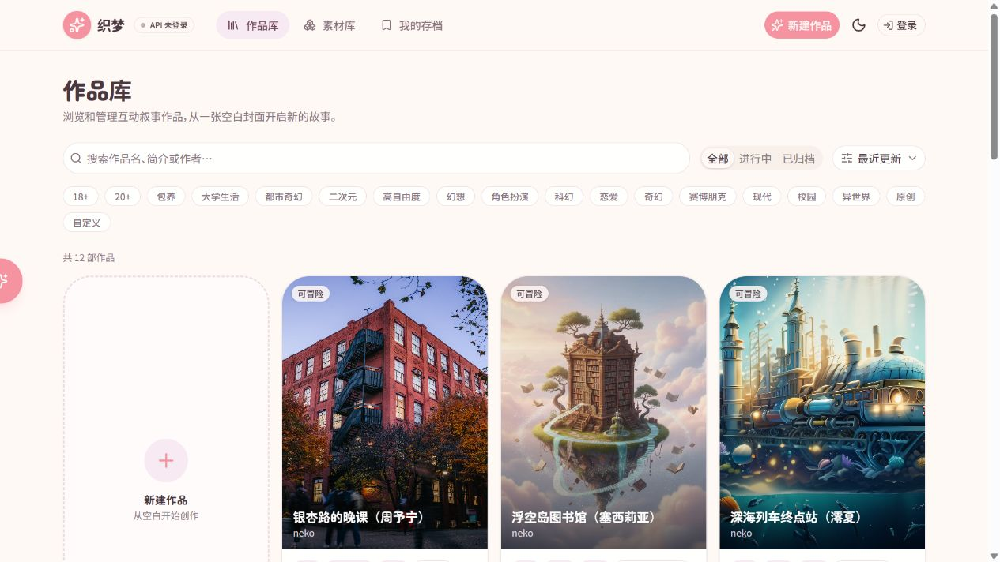
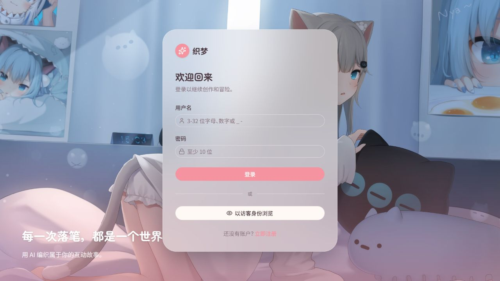

# 织梦 · AI 文字冒险

<p align="center">
  <strong>把角色、世界书与每一次选择，编织成会继续生长的故事。</strong><br>
  本地优先的中文 AI 文字冒险创作与游玩平台
</p>

<p align="center">
  <a href="#产品预览">产品预览</a> ·
  <a href="#核心能力">核心能力</a> ·
  <a href="#快速开始">快速开始</a> ·
  <a href="#项目结构">项目结构</a>
</p>

<p align="center">
  
  
  
  
</p>

## 产品预览

下面的截图来自本地运行中的真实页面，展示公开作品浏览和账户入口。未配置 AI Key 时，应用仍可使用确定性的后端 mock 回复进行本地体验。

<p align="center">
  
  
</p>

## 核心能力

| 模块 | 能力 |
| --- | --- |
| 作品库 | 浏览作品、搜索与标签筛选、作品详情、封面、作者信息和可冒险入口 |
| 创作台 | 组合有序多角色卡、世界书、开场文本、玩家属性、回复模板与作品设定 |
| 角色卡 / 世界书 | 独立素材库、关键词触发、恒定注入、优先级、引用关系和可移植导入导出 |
| 冒险引擎 | SSE 流式生成、剧情选项、结构化状态变化、快捷指令和开局设定 |
| 存档系统 | 自动保存、手动存档、读档、会话分支、长期记忆与上下文压缩 |
| 账户与 AI | 多账号数据隔离、账户级模型设置、API 激活检测、访客浏览和 CSRF 防护 |
| 管理工作区 | 受控站长账户、用户状态维护、资源检索、审计信息和素材草稿审核 |

## 一次冒险如何流动

```text
作品库 → 作品详情 → 开局设定 → SSE 对话
                         ↓
             选项 / 状态 / 世界书 / 长期记忆
                         ↓
                   存档 · 读档 · 分支
```

每次创建会话时，角色卡会被冻结为快照，因此后续修改素材不会悄悄改写已经开始的故事。生成内容中的可见叙事与结构化状态、选项、判定信息会分开处理，最终再持久化到当前账户。

## 兼容与数据边界

- 支持角色卡和世界书的普通 JSON 导入导出。
- 支持 SillyTavern V3 角色卡 JSON、PNG 元数据和世界书字段的迁移。
- 兼容导入会尽量保留二级关键词、选择性注入、正则和插入位置等外部字段。
- 当前运行时重点执行启用状态、主关键词、恒定注入和优先级；未执行的高级语义不会被伪装成已经生效。
- AI 生成的角色卡 / 世界书先作为可编辑草稿展示，确认后才写入素材库。

## 快速开始

### 1. 安装依赖并启动

```powershell
git clone https://github.com/chsocialcats-prog/nekodesu.git
Set-Location nekodesu

python -m pip install -r requirements.txt
python start.py --no-browser
```

打开 <http://127.0.0.1:8000>。想让启动器自动打开浏览器时，使用：

```powershell
python start.py
```

### 2. 配置 AI Provider（可选）

未配置 Key 时可以浏览公开作品，并使用后端 mock 回复完成本地联调。需要真实生成时，可在登录后的设置 / API 激活页面配置 DeepSeek 兼容服务：

| 环境变量 | 作用 |
| --- | --- |
| `DEEPSEEK_API_KEY` | Provider API Key |
| `DEEPSEEK_BASE_URL` | OpenAI 兼容 API 根地址 |
| `DEEPSEEK_MODEL` | 默认模型名 |

也可以复制 `config.example.json` 为本地 `config.json`；真实密钥不会写入示例文件、README 或日志。

### 3. 前端开发检查

```powershell
Push-Location frontend
pnpm install
pnpm exec tsc --noEmit
pnpm build
Pop-Location
```

## 项目结构

```text
backend/
├── ai/                    DeepSeek / OpenAI 兼容客户端与 mock 客户端
├── auth/                  账户、会话、权限和 CSRF 依赖
├── repository/            cards、works、worldbooks、conversations、snapshots
├── routers/               配置、资源 CRUD、管理和 SSE 聊天路由
├── services/              冒险引擎、上下文、状态、存档、管理和素材草稿
├── database.py            SQLite 初始化与迁移
└── schemas.py             API 请求模型
frontend/
├── app/                   Next.js 路由和全局页面入口
├── components/            页面视图、冒险控制与通用 UI
├── lib/                   API、会话、Provider 和激活状态工具
├── public/                公开静态资源
└── out/                   Next.js 静态导出产物
docs/
└── screenshots/           README 产品预览截图
插画/                      登录页插画源文件，构建时同步至前端公开资源
start.py                   Windows 启动器
config.example.json        可安全提交的本地配置模板
```

## 测试

完整后端测试：

```powershell
python -m unittest discover -s backend -p 'test_*.py'
```

前端类型检查和静态导出：

```powershell
Push-Location frontend
pnpm exec tsc --noEmit
pnpm build
Pop-Location
```

启动服务后，可额外运行后端冒烟测试：

```powershell
python backend/smoke_test.py
```

## 运行与安全说明

<details>
<summary>展开查看本地部署注意事项</summary>

- 应用故意保持单进程运行。会话生成锁和 stop 事件保存在 FastAPI 进程内存中，不要使用 Uvicorn 多 worker 或多进程模式。
- SQLite 运行数据默认位于 `data/app.db`；不要手动编辑、提交或把它当作迁移文件。
- `NEKO_AUTH_KEYS`、`NEKO_AUTH_KEY_PATH`、`NEKO_COOKIE_SECURE`、`NEKO_PUBLIC_ORIGIN`、`NEKO_TRUSTED_PROXY_CIDRS` 和 `NEKO_AI_HTTPS_ONLY` 用于生产环境的认证与代理边界。
- 浏览器使用 HttpOnly 的 `neko_session` 会话 Cookie，以及非 HttpOnly 的 `neko_csrf` 双提交 Cookie。写请求需要同源 `Origin` / `Referer` 和 `X-CSRF-Token`。
- 局域网 HTTP 只适合可信开发网络；公开部署请使用 HTTPS、Secure Cookie 和固定 public origin，并先备份数据目录与认证密钥材料。

</details>

当前 API 路由和 schema 以 `backend.main.app.openapi()`、`backend/schemas.py`、路由实现及测试为准；认证、隔离、SSE 与兼容语义的补充说明见 [`docs/api-contract.md`](docs/api-contract.md)。
